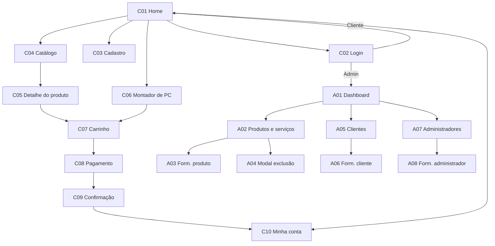

# HardwareHub: Loja Online de Hardware

Trabalho da disciplina **SCC0219 - Introduction to Web Development**.

## Identificação do grupo

| Nome                     | NUSP     |
| ------------------------ | -------- |
| Bruno Rusca Janini       | 13674917 |
| Gabriel dos Santos Alves | 14614032 |
| Leonardo Ribeiro Zanatta | 5521484  |

**Milestone atual:** 1 Mockup da loja

---

## 1. Requisitos

### 1.1 Requisitos do enunciado

- O sistema possui 2 tipos de usuário: **Clientes** e **Administradores**.
- O administrador registra e gerencia administradores, clientes e produtos/serviços. A conta `admin` (senha `admin`) já vem cadastrada.
- O cliente acessa o sistema para comprar produtos/serviços.
- Cadastro de administrador: nome, id, telefone, e-mail.
- Cadastro de cliente: nome, id, endereço, telefone, e-mail.
- Cadastro de produto/serviço: nome, id, foto, descrição, preço, quantidade em estoque e quantidade vendida.
- Venda: o cliente escolhe produtos, define a quantidade e os coloca no carrinho. O pagamento é feito com número de cartão (qualquer número é aceito). Ao pagar, o estoque diminui e a quantidade vendida aumenta. O carrinho só é esvaziado no pagamento ou pelo cliente.
- Gerenciamento: o administrador faz CRUD de produtos/serviços (inclusive alterar estoque).
- Funcionalidade própria da loja (ver 1.2).
- Acessibilidade, usabilidade e boa responsividade (tempo de resposta).

### 1.2 Requisitos específicos da nossa loja

- A loja vende **produtos** (Processador, Placa-mãe, Memória RAM, Placa de vídeo, Armazenamento, Fonte, Gabinete) e **serviços** (Montagem de PC, Instalação de sistema operacional, Limpeza e troca de pasta térmica, Upgrade de memória).
- Serviços não têm limite de estoque (exibidos como "Sob agendamento").
- Catálogo com filtros (categoria, preço, marca, disponibilidade e specs) e ordenação.
- Cada produto tem **especificações** (`specs`) que variam por categoria e são usadas nos filtros e no Montador.
- **Funcionalidade própria — Montador de PC:** o cliente escolhe uma peça por categoria; o sistema valida a compatibilidade e, se tudo estiver correto, adiciona o conjunto ao carrinho (com opção de incluir o serviço de montagem). Montagens podem ser salvas na conta do cliente. Planejamos implementar o **analisador de compatibilidade com IA** (ver 2.5).
- Acessibilidade: contraste AA, rótulos visíveis nos campos, foco visível, alvos clicáveis ≥ 44 px, informação nunca só por cor (ícone + texto), texto alternativo nas imagens.

---

## 2. Descrição do projeto

### 2.1 Funcionalidades

**Cliente**

- Ver a página inicial, fazer login e criar conta.
- Navegar pelo catálogo (produtos e serviços), filtrar, ordenar e ver detalhes.
- Usar o **Montador de PC** com verificação de compatibilidade feita por IA.
- Gerenciar o carrinho (alterar quantidades, remover itens, esvaziar).
- Pagar com número de cartão e receber a confirmação do pedido.
- Editar seus dados, consultar pedidos e montagens salvas.

**Administrador**

- Ver o dashboard (indicadores e estoque baixo).
- CRUD de produtos/serviços (inclui edição rápida de estoque).
- CRUD de clientes.
- CRUD de administradores (a conta `admin` padrão não pode ser excluída).

### 2.2 Aplicação SPA e navegação

A aplicação segue o estilo **Single-Page Application**: header e footer fixos; apenas o conteúdo central (`main`) muda entre as telas.

### 2.3 Mockups das telas

O mockup completo, com todas as telas, está na pasta `docs` em formato PDF: [Mockup completo (PDF)](docs/mockup.pdf). As telas implementadas em HTML5/CSS3 (abrir no navegador) estão listadas abaixo.

| ID  | Tela                     | Mockup                                   |
| --- | ------------------------ | ---------------------------------------- |
| C01 | Home (com área de login) | [HTML](mockups-html/home.html)           |
| C06 | Montador de PC           | [HTML](mockups-html/montar-pc.html)      |
| A02 | Produtos e serviços      | [HTML](mockups-html/admin-produtos.html) |

### 2.4 Informações salvas no servidor

- **Administradores:** id, nome, telefone, e-mail, senha.
- **Clientes:** id, nome, endereço (rua, número, cidade, CEP), telefone, e-mail, senha.
- **Produtos/serviços:** id, nome, tipo, categoria, foto, descrição, preço, quantidade em estoque, quantidade vendida, specs.
- **Carrinhos:** cliente, itens e quantidades.
- **Pedidos:** itens, valor total, data, cartão mascarado, endereço de entrega, status.
- **Montagens salvas:** cliente e peças escolhidas no Montador.

### 2.5 Análise de compatibilidade com IA (planejado)

Estamos planejando implementar o analisador de compatibilidade do Montador de PC com **IA**. A ideia é enviar as peças escolhidas pelo cliente (com suas especificações) e receber uma análise indicando se o conjunto é compatível, quais são os problemas encontrados e sugestões de troca. O resultado será exibido no painel de compatibilidade do Montador antes de adicionar o conjunto ao carrinho.

Os detalhes de implementação (serviço de IA utilizado, formato da requisição e da resposta) serão definidos nos próximos milestones. Neste Milestone 1, o painel de compatibilidade aparece apenas como mockup estático.

---

## 3. Comentários sobre o código

Nenhum comentário por enquanto (Milestone 1 contém apenas mockups estáticos em HTML5/CSS3).

Organização prevista: `mockups-html/css/styles.css` concentra as variáveis de cor, tipografia e componentes reutilizáveis (header, footer, card de produto, botões, inputs).

## 4. Plano de testes

[A completar nos próximos milestones.] Previsão:

- Roteiro de testes manuais das funcionalidades (login, cadastro, catálogo, Montador, carrinho, pagamento, CRUD do administrador).
- Testes da API do servidor com Postman.
- Verificação de acessibilidade (contraste, navegação por teclado) e responsividade (desktop 1440 px e mobile 390 px).
- Testes do analisador de compatibilidade com IA usando combinações de peças compatíveis e incompatíveis conhecidas.

## 5. Resultados dos testes

[A completar nos próximos milestones.]

## 6. Procedimentos de build

Para visualizar os mockups em HTML (Milestone 1):

1. Clone o repositório: `git clone [URL do repositório]`
2. Entre na pasta: `cd [nome-do-repositório]/mockups-html`
3. Abra o arquivo `home.html` em um navegador (Chrome, Firefox ou Edge).

As demais telas estão no PDF do mockup completo em `docs/` e no link do Figma acima.

## 7. Problemas

[Nenhum problema relevante até o momento.]

## 8. Comentários

Sem comentários.
